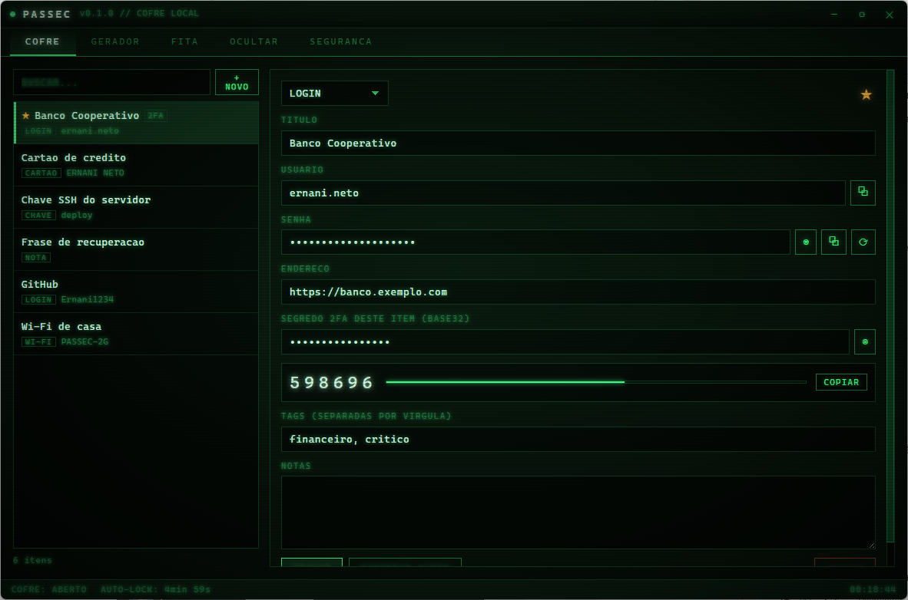
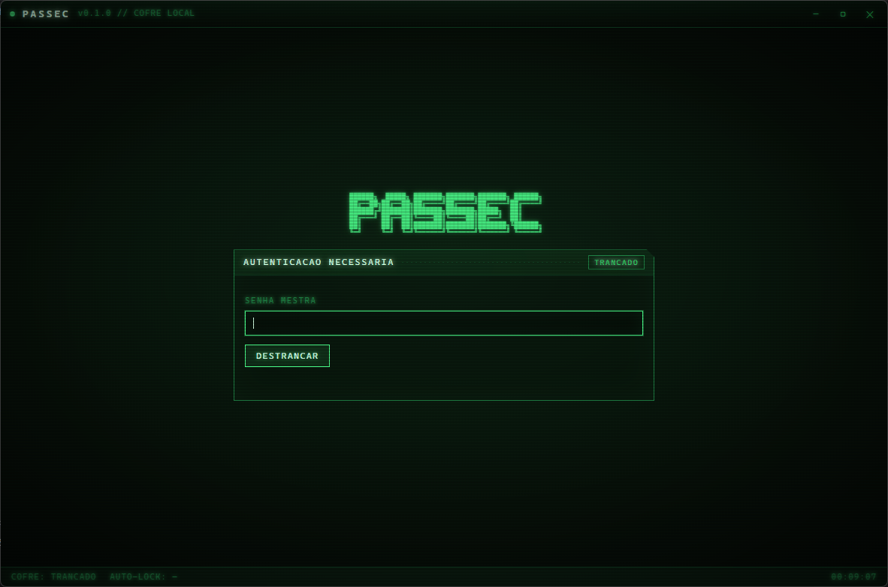
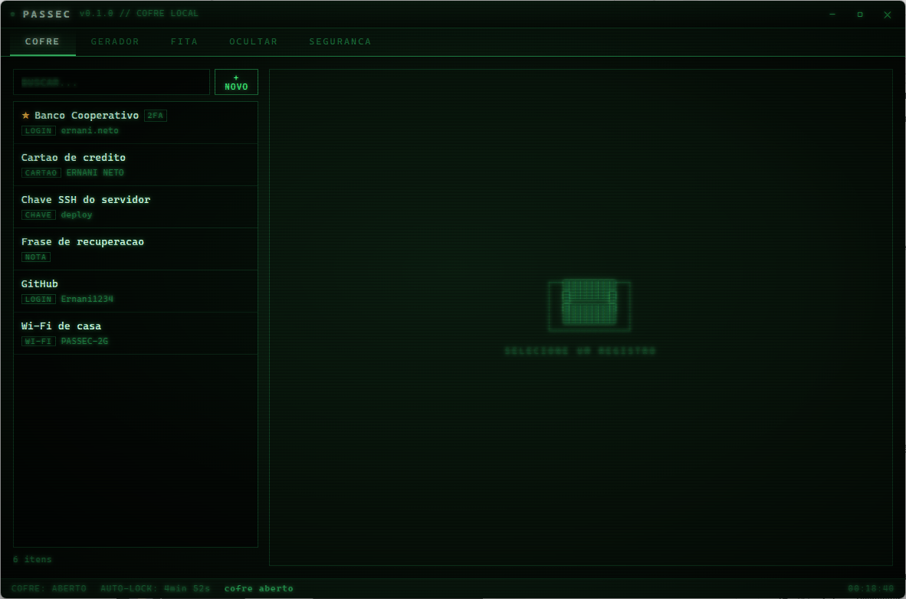
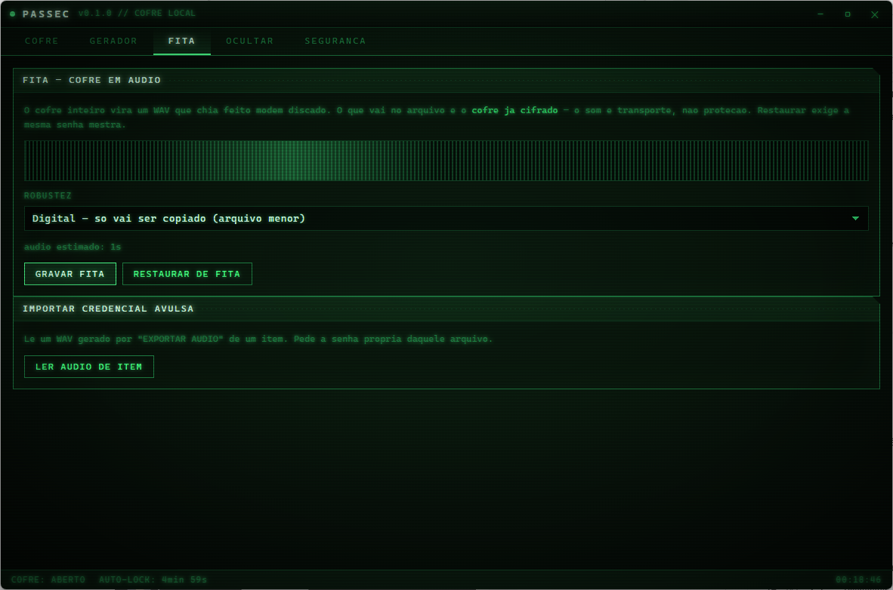
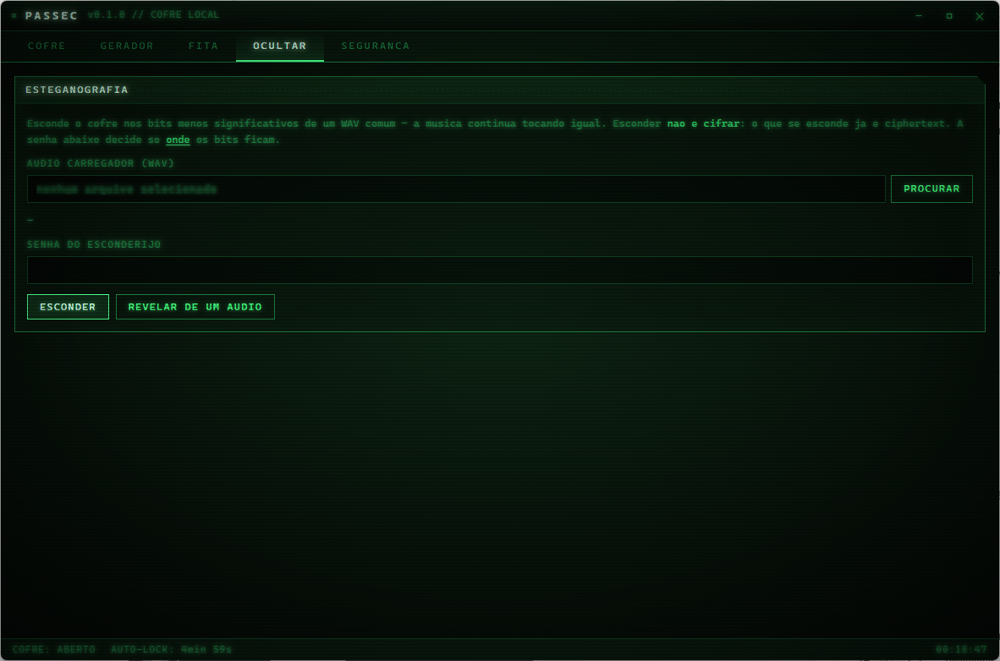
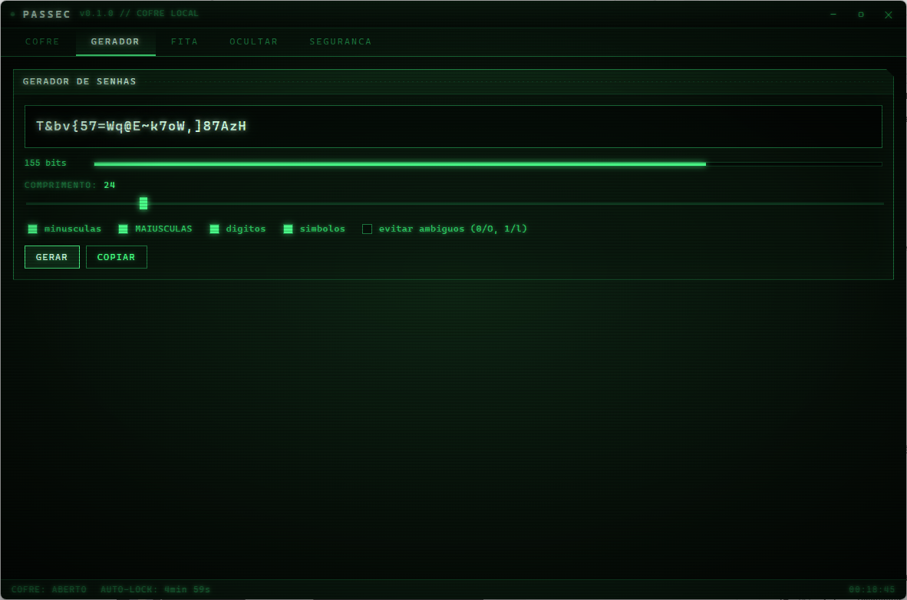
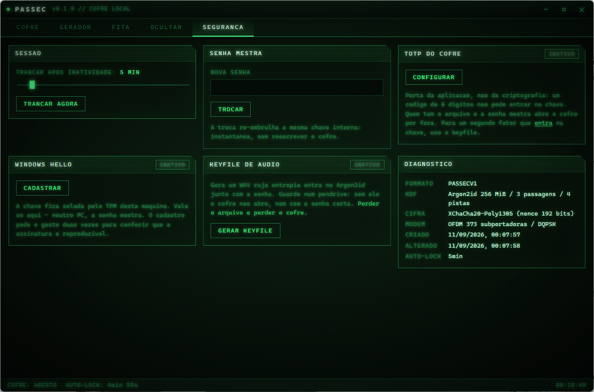
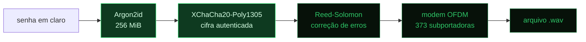
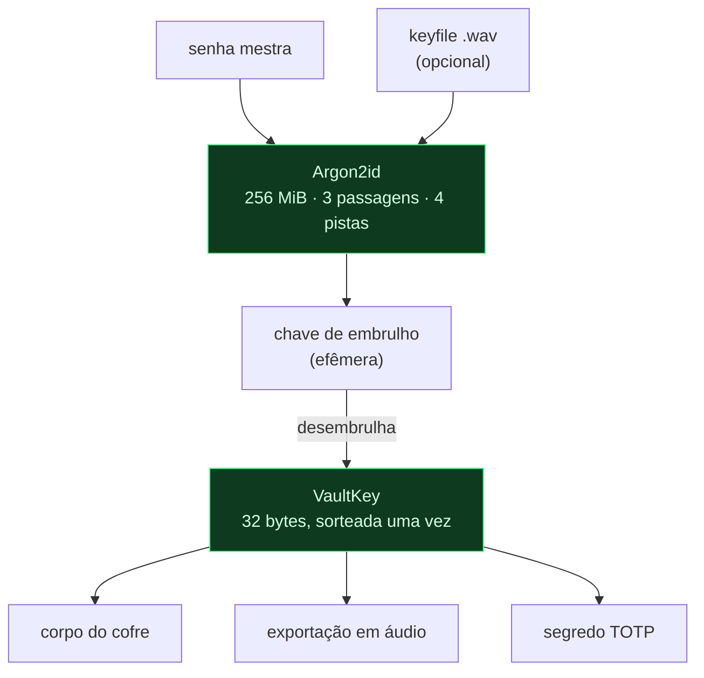
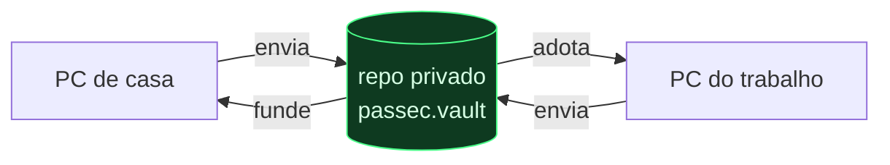

<div align="center">

# PASSEC

**Cofre de credenciais offline com criptografia autenticada e transporte de dados por áudio.**

Interface de terminal de fósforo verde. Sem servidor próprio e sem telemetria —
a sincronização é opcional e usa um repositório privado seu.

[](https://www.rust-lang.org/)
[](https://tauri.app/)
[](#testes)
[](#instalação)
[](LICENSE)



</div>

<div align="center">

| | |
|:-:|:-:|
| <br>**Bloqueio** — Argon2id de 256 MiB | <br>**Cofre** — logins, notas, cartões, chaves |
| <br>**Fita** — o cofre inteiro vira áudio | <br>**Ocultar** — cofre escondido numa música |
| <br>**Gerador** — entropia calculada, sem viés | <br>**Segurança** — TOTP, Hello, keyfile |

</div>

---

## Índice

- [O problema que este projeto resolve diferente](#o-problema-que-este-projeto-resolve-diferente)
- [Recursos](#recursos)
- [Modelo de segurança](#modelo-de-segurança)
  - [O que protege](#o-que-protege)
  - [O que NÃO protege](#o-que-não-protege)
- [Como o áudio funciona](#como-o-áudio-funciona)
- [Sincronização entre computadores](#sincronização-entre-computadores)
- [Itens sob demanda](#itens-sob-demanda)
- [Modo em guarda](#modo-em-guarda)
- [Instalação](#instalação)
- [Uso](#uso)
- [Arquitetura](#arquitetura)
- [Formato do arquivo](#formato-do-arquivo)
- [Testes](#testes)
- [Decisões que saíram de medição](#decisões-que-saíram-de-medição)
- [Limitações conhecidas](#limitações-conhecidas)
- [Licença](#licença)

---

## O problema que este projeto resolve diferente

Existe uma família de projetos que "transforma senhas em imagens": os bytes do
segredo viram pixels de um PNG, e o PNG é tratado como se fosse o cofre.

O problema conceitual é que **codificação não é criptografia**. Converter bytes
em pixels — ou em ondas sonoras — não esconde nada: quem tiver o arquivo
decodifica. O formato muda, o segredo continua lá.

O PASSEC inverte a ordem, e essa inversão é o ponto central do projeto:



As duas primeiras caixas carregam a segurança. As três últimas são **apenas
formato**. O que entra no WAV já é ciphertext autenticado: se o arquivo vazar, o
atacante ganha exatamente o que ganharia roubando o arquivo do cofre — ruído
indistinguível de aleatório.

Isso libera o áudio para fazer o que ele realmente faz bem.

| Modo | O que é | Para quê serve |
|------|---------|----------------|
| **Fita** | O cofre inteiro vira um WAV que chia feito modem discado | Backup que cabe num memo de voz, num CD, num anexo qualquer |
| **Keyfile** | Um WAV cuja entropia entra no Argon2id junto com a senha | Segundo fator que *de fato* entra na chave |
| **Esteganografia** | O cofre escondido nos bits baixos de uma música | Negação plausível — o arquivo continua tocando normal |
| **Item avulso** | Uma credencial num WAV curto, com senha própria | Levar uma senha para outra máquina sem levar o cofre |

---

## Recursos

**Cofre**
- Logins, notas, cartões, identidades, chaves e redes Wi-Fi
- Busca por título, usuário, endereço e tags
- Favoritos, campos personalizados e anotações livres
- 2FA por item (TOTP do site guardado), com código ao vivo e contagem regressiva
- Gravação atômica: toda edição já está cifrada em disco quando a tela responde

**Autenticação**
- Senha mestra com Argon2id de 256 MiB
- Keyfile de áudio como segundo fator que entra na derivação da chave
- TOTP (RFC 6238) para destrancar o aplicativo, com QR code no cadastro
- Windows Hello via TPM, com verificação de reprodutibilidade no cadastro
- Freio exponencial contra tentativas repetidas
- Auto-lock por inatividade, com vigia em segundo plano

**Gerador**
- Amostragem uniforme com rejeição (sem o viés do `byte % n`)
- Garante ao menos um caractere de cada classe pedida
- Entropia calculada e medidor de força conservador

**Áudio**
- Modem OFDM/DQPSK a ~31 kbit/s
- Correção de erros Reed-Solomon com robustez escolhível
- Esteganografia LSB com posições derivadas da chave

**Nuvem**
- Sincronização por repositório privado do GitHub, com histórico de versões
- Fusão item a item: dois computadores editando não perdem trabalho
- Exclusões propagam corretamente (lápides), em vez de ressuscitar itens
- **Itens sob demanda**: escolha quais credenciais ficam no disco de cada
  computador; o resto continua na nuvem

**Modo em guarda**
- Tranca a tela sem fechar o cofre, para a pausa curta (`Ctrl+G`)
- Volta com uma combinação de teclas de comprimento à sua escolha
- Vira bloqueio de verdade sozinho em 3 minutos, ou após 5 erros

**Interface**
- Terminal monocromático de fósforo verde, com linhas de varredura e vinheta
- Área de transferência apagada sozinha em 25 segundos
- `Ctrl+L` tranca de verdade; `Ctrl+G` entra em modo em guarda

---

## Modelo de segurança

### O que protege

**Envelope de duas camadas.**



A `VaultKey` é sorteada uma única vez, na criação, e nunca muda. Trocar a senha
mestra apenas re-embrulha os mesmos 32 bytes — é instantâneo mesmo num cofre de
milhares de itens, e não reescreve o corpo cifrado.

**Os 256 MiB são o parâmetro que carrega a segurança.** Obrigam o atacante a
gastar 256 MiB *por tentativa paralela*, o que derruba o ganho de GPU e
inviabiliza ASIC. Custa cerca de um segundo numa CPU de desktop.

**Downgrade de KDF é detectado.** Os parâmetros do Argon2id ficam em claro no
arquivo — sem eles não há como derivar a chave —, mas viajam como dado associado
autenticado nas duas camadas de cifra. Editar o arquivo para pedir 8 KiB em vez
de 256 MiB invalida a tag Poly1305 e a abertura falha, em vez de ficar barata.

**Nonce aleatório, sem contador.** XChaCha20 tem nonce de 192 bits, grande o
bastante para ser sorteado sem risco prático de colisão. Com os 96 bits do
AES-GCM seria preciso manter um contador persistente — e um contador que regride
(restaurar backup, copiar o cofre para outra máquina) reusa nonce e quebra a
confidencialidade por inteiro.

**O cofre inteiro é um único blob cifrado.** Nem os títulos, nem a quantidade de
itens, nem os tamanhos ficam visíveis. Cifrar item a item seria mais cômodo para
edições pontuais e vazaria a forma do conteúdo.

**Segredos são apagados da RAM.** Chaves e campos sensíveis se zeram ao sair de
escopo. A interface recebe resumos sem senha; a senha só atravessa o IPC quando
o usuário abre um item específico.

**Mensagens de erro não viram oráculo.** "Senha errada" e "arquivo corrompido"
produzem a mesma mensagem, deliberadamente vaga. Comparações de código TOTP são
feitas em tempo constante.

### O que NÃO protege

Esta seção vale mais que a anterior.

- **TOTP não entra na chave.** É porta da aplicação, não da criptografia — um
  código de 6 dígitos tem 10⁶ possibilidades e cairia em milissegundos, sem nem
  tocar no Argon2id. Quem tem o arquivo *e* a senha mestra abre o cofre com
  qualquer implementação, ignorando o TOTP. Ele barra o acesso oportunista a
  esta instalação: o colega que senta na máquina e sabe a senha. Para um segundo
  fator que realmente entra na chave, use o **keyfile**.

- **Esteganografia não é cifra.** Ela decide *onde* o ciphertext mora, não se
  ele é legível. Serve como negação plausível, nunca como defesa. Se alguém
  descobrir o esconderijo, encontra ruído cifrado — não senhas.

- **Windows Hello vale só naquela máquina.** A chave fica selada pelo TPM local.
  Noutro PC, a senha mestra — que segue sendo o caminho principal e o único
  backup.

- **A avaliação de força de senha é um palpite conservador.** Medir de verdade
  exigiria comparar com listas de vazamentos, o que um aplicativo offline não
  faz. Serve para pegar o óbvio — senha curta, uma classe só, repetição,
  sequência de teclado — e nunca para dar carimbo de aprovação.

- **Não houve auditoria externa.** A criptografia usa primitivas padrão
  (`argon2`, `chacha20poly1305`, `blake3`) em composições convencionais, mas
  isso não substitui revisão independente.

- **O caminho aéreo não foi validado em hardware.** O modem foi medido contra
  ruído branco, atenuação forte, deslocamento temporal e reamostragem — todos
  sintéticos. Tocar num alto-falante e regravar por microfone deve funcionar
  pelo projeto (prefixo cíclico, DQPSK, FEC), mas não foi testado com
  equipamento real.

> [!WARNING]
> **Perder o keyfile é perder o cofre.** Se o cofre exigir keyfile, não há
> recuperação sem ele: a entropia do arquivo entra no Argon2id, então sem ele a
> chave simplesmente não existe. Guarde cópias em mais de um lugar.

---

## Como o áudio funciona

### Modem OFDM/DQPSK — ~31 kbit/s

A banda audível é dividida em **373 subportadoras** que transmitem em paralelo,
de 562 Hz a 18 kHz. Uma portadora única com sinalização serial (FSK, tipo modem
discado) daria algumas centenas de bits por segundo — um cofre de 60 KB levaria
horas de chiado. Assim ele cabe em cerca de 18 segundos.

Cada par de bits vira uma **diferença** de fase entre símbolos consecutivos da
mesma subportadora (DQPSK). O canal — distância ao microfone, atraso da placa de
som, o que for — se cancela sozinho na subtração, o que dispensa estimar e
rastrear a fase absoluta. Custa ~3 dB de relação sinal-ruído e economiza o
rastreador de canal inteiro.

O **prefixo cíclico** de 128 amostras absorve eco: se o som bate na parede e
volta atrasado, o atraso cai dentro do prefixo e não contamina o símbolo
seguinte. São 2,7 ms de tolerância, o suficiente para a reverberação de uma sala
comum.

A **sincronização** usa um chirp — uma varredura de 500 Hz a 18 kHz — porque sua
autocorrelação é um pico estreito e isolado, o que localiza o início do sinal com
precisão de amostra mesmo com o sinal enterrado em ruído.

### Correção de erros por erasure coding

O canal de áudio perde dados em **rajadas**: um clique, uma saturação, um corte
de meio segundo. Erros isolados são raros; blocos inteiros somem.

Por isso o esquema é erasure coding, não correção cega: cada bloco carrega um
CRC32 e, se o CRC não bate, o bloco é descartado inteiro e vira uma lacuna de
**posição conhecida**. Reed-Solomon reconstrói lacunas com o dobro da eficiência
com que corrige erros de posição desconhecida — `parity` lacunas custam `parity`
blocos, contra `2 × parity` no caso cego.

Pela mesma razão os blocos vão no fio em ordem sequencial, **sem interleaving**.
Interleaving espalharia uma rajada por muitos blocos, estragando o CRC de todos;
mantendo a ordem, a rajada se concentra em poucos e o resto sobrevive intacto.

| Robustez | Paridade | Para quê |
|----------|----------|----------|
| **Digital** | ~12% | Arquivo que só será copiado bit a bit |
| **Aéreo** | ~40% | Vai ser tocado, regravado ou recomprimido |

---

## Sincronização entre computadores

O cofre pode viver num repositório **privado** do GitHub, e aí qualquer
computador com o PASSEC instalado chega nas suas credenciais com a senha
mestra.

### Isso é seguro?

O GitHub recebe o mesmo blob XChaCha20-Poly1305 que estaria no seu disco. Ele
não consegue abrir — é o modelo do Bitwarden e do 1Password, onde o servidor
também só guarda ciphertext. Cada sincronização vira um commit, então você
ganha **histórico**: dá para voltar o cofre a uma versão de semanas atrás.

O repositório precisa ser privado. Não porque o conteúdo seja legível, mas
porque publicá-lo entrega ao mundo um alvo para força bruta offline contra a
sua senha mestra. O app avisa em destaque se detectar um repositório público.

### Um cofre, muitas cópias

Esta é a parte que costuma surpreender, e ela decide o desenho inteiro:

> **Criar um cofre novo com a mesma senha não recupera nada.**

Cada criação sorteia um salt e uma VaultKey próprios. Dois cofres criados
separadamente, ainda que com senhas idênticas, são mutuamente ilegíveis. Por
isso o computador novo **adota** o arquivo remoto (botão `TENHO UM COFRE NA
NUVEM` na tela de bloqueio) em vez de criar o seu.



### Fusão item a item

O caso comum não é "um lado mudou": é você ter editado uma senha em casa e
cadastrado outra coisa no trabalho. Jogar o arquivo numa pasta compartilhada
resolveria isso perdendo o trabalho de um dos lados em silêncio.

Aqui a fusão é por item. Cada entrada tem `id` estável e `updated_at`, então
para cada id vence a versão editada por último — e o resto convive.

**Exclusões precisam de cuidado especial.** Apagar não pode ser só sumir da
lista: se o computador A apaga um item e o B ainda o tem, a regra "vence quem
tem" o ressuscitaria, e você apagaria de novo, e de novo. O PASSEC registra uma
*lápide* com a data da exclusão, e ela compete de igual para igual com a edição:
apagar às 10h vence editar às 9h, e editar às 11h vence apagar às 10h. As
lápides são descartadas depois de seis meses.

**Conflito de escrita simultânea** é barrado pelo GitHub: cada envio cita o
`sha` da versão que foi lida, e se outro computador escreveu nesse intervalo a
operação falha em vez de sobrescrever. O app pede para sincronizar de novo,
agora lendo a versão nova.

### Como configurar

1. Crie um repositório **privado** no GitHub (ex.: `passec-vault`). Pode ficar
   vazio.
2. Gere um token em **Settings → Developer settings → Personal access tokens →
   Fine-grained tokens**, com acesso apenas a esse repositório e permissão
   **Contents: Read and write**.
3. No PASSEC, aba `NUVEM`: preencha dono, repositório, caminho e token, e clique
   em `CONECTAR`. A primeira sincronização sobe o cofre.
4. No outro computador: tela de bloqueio → `TENHO UM COFRE NA NUVEM` → mesmos
   dados mais a senha mestra.

O token fica guardado dentro do cofre cifrado, então só existe em claro
enquanto o cofre está destrancado.

### O token é por computador — e é descartável

Há uma circularidade inevitável no primeiro acesso de um computador novo: o
token mora *dentro* do cofre, mas para baixar o cofre é preciso do token. Por
isso, na primeira vez em cada máquina você informa os quatro dados do
repositório mais a senha mestra. Daí em diante aquele computador não pede mais
nada.

O jeito prático de lidar com isso **não é carregar o token**, e sim gerar um
novo quando precisar: diferente do keyfile, perder o token não custa nada —
você entra no GitHub e gera outro em um minuto. Nada para guardar no bolso,
nada para vazar num papel.

Isso deixa dois segredos independentes protegendo o cofre: **acesso à sua conta
do GitHub** e a **senha mestra**. Quem souber apenas a senha não alcança o
arquivo, porque o repositório é privado.

> [!IMPORTANT]
> Como consequência, a conta do GitHub passa a fazer parte do modelo de
> segurança — vale manter 2FA ativo nela. E se um computador for perdido,
> revogue o token dele em **Settings → Developer settings → Personal access
> tokens**: isso corta o acesso daquela máquina à nuvem sem mexer no cofre nem
> nas outras.

### Os limites

- **O relógio de cada máquina arbitra os empates.** Um computador com a hora
  muito errada vence disputas que não deveria. Resolver isso de verdade exigiria
  relógios vetoriais e um diálogo de conflito na interface — trabalho que só se
  paga em edição concorrente frequente, o que não é o caso de um cofre pessoal.
- **Um computador parado mais de seis meses ressuscita itens apagados**, porque
  as lápides já terão expirado.
- **A sincronização não é automática.** É um botão. Não há polling nem daemon.

---

## Itens sob demanda

Nem todo computador precisa de todas as credenciais. O PC do trabalho, ou um
emprestado, pode carregar só o punhado que você usa ali — o resto continua na
nuvem e **não toca o disco daquela máquina**.

Na aba `NUVEM`, a lista mostra tudo que existe no cofre, marcando o que está
aqui e o que só está na nuvem. `OCULTAR` tira do disco local; `TRAZER` traz de
volta.

### Ocultar não é apagar

São operações diferentes no código, e confundi-las custaria caro:

| | O que faz | Propaga? |
|---|---|---|
| **Apagar** | Remove o item e deixa uma **lápide** | Sim — some de todos os computadores |
| **Ocultar** | Tira do disco local e registra a preferência | Não — o item segue na nuvem |

Antes de ocultar, o app **confirma pela rede** que o item já está na nuvem. Sem
essa checagem, ocultar algo que ainda não subiu seria apagá-lo para sempre.

No formulário de um item, os dois botões ficam lado a lado e dizem o alcance de
cada um: `TIRAR DESTE PC` e `APAGAR DE TODOS`. O segundo pede uma confirmação
que soletra o que vai acontecer — apagar viaja para a nuvem e para os outros
computadores, e o diálogo aponta o primeiro botão como alternativa.

### Recuperar algo apagado por engano

Como cada sincronização é um commit, o cofre anterior continua no histórico do
repositório. Dois caminhos, conforme o caso:

- **Apagou e ainda não sincronizou:** o item segue intacto na nuvem. Vá em
  `NUVEM` → `ATUALIZAR LISTA`, ele aparece marcado como `NUVEM`, e `TRAZER` o
  recupera. **Não sincronize antes disso** — a lápide local apagaria o item de
  lá.
- **Apagou e já sincronizou:** abra o histórico do arquivo no GitHub
  (`commits/main/passec.vault`), baixe uma versão anterior e restaure.

`TRAZER` desfaz tanto um ocultamento quanto uma exclusão: além de trazer o item,
ele remove a lápide e redata a entrada. Sem essas duas coisas, o item voltaria
para a tela e sumiria de novo na sincronização seguinte, porque a lápide é mais
recente que a entrada restaurada e venceria a disputa.

### Três coisas que não viajam

A escolha do que fica é de cada máquina, e junto com ela ficam mais duas:

- **A lista de ocultos** — senão uma máquina imporia a escolha às outras.
- **O token do GitHub** — se subisse, revogar o token de um computador perdido
  não adiantaria: ele voltaria na próxima sincronização dos demais.
- **A combinação de teclas** — é curta e ligada àquele teclado.

Na sincronização, a nuvem recebe a **união completa**; o disco local recebe a
união menos os ocultos.

> [!NOTE]
> A distinção é sobre o **disco**. Para montar a lista de títulos, o corpo
> remoto é decifrado e passa inteiro pela memória. Um item oculto não fica
> gravado na máquina — mas isso não é uma barreira contra quem já está com a
> sessão aberta na sua frente.

---

## Modo em guarda

Para a pausa curta: o café, alguém que chega na mesa. `Ctrl+G` fecha a interface
na hora, e voltar custa uma combinação de teclas em vez de um Argon2id de
256 MiB.

### O que ele protege — e o que não

**Em guarda não é criptografia.** As chaves continuam vivas no processo, então
quem tiver acesso técnico à máquina — um depurador, um dump de memória — alcança
o cofre sem passar por aqui. O que este modo barra é **a pessoa que senta na sua
cadeira**.

Isso não é uma limitação que dê para consertar. O caminho seguro seria descartar
as chaves, e aí sair do modo exigiria *derivar a chave de novo* — o que uma
combinação de teclas não consegue fazer. Seis teclas dão cerca de 2 bilhões de
possibilidades; o Argon2id existe justamente porque isso cai em segundos num
ataque offline. Derivar a chave do cofre a partir dela seria trocar a senha
mestra por um PIN e chamar de segurança.

Por isso o modo tem prazo e limite:

- **3 minutos** sem ninguém voltar e ele vira bloqueio de verdade, com as chaves
  descartadas
- **5 erros** na combinação trancam na hora, devolvendo o problema ao Argon2id
- **Mexer no mouse não adia nada**: o relógio não é renovado enquanto o modo
  está ativo

Enquanto ativo, **nenhum comando lê o cofre** — a barreira é no backend, não na
tela. Sem isso o modo seria só uma cortina visual, com a interface ainda podendo
pedir qualquer senha pelo IPC.

A combinação é definida na aba `SEGURANÇA`, tem de 3 a 16 teclas e é conferida
em tempo constante. Ela nunca abre um cofre fechado — só sai do modo em guarda.

---

## Instalação

### Binário pronto

| Arquivo | Tamanho | Descrição |
|---------|---------|-----------|
| [**PASSEC_0.1.0_x64-setup.exe**](release/PASSEC_0.1.0_x64-setup.exe) | 2,0 MB | Instalador NSIS, por usuário, sem exigir administrador |
| [**PASSEC_0.1.0_x64-portable.exe**](release/PASSEC_0.1.0_x64-portable.exe) | 5,4 MB | Executável avulso, roda sem instalar |

Requer **Windows 10/11** com WebView2 (já vem no Windows 11).

> O binário inteiro cabe em 5,4 MB porque o Tauri usa o WebView2 do sistema em
> vez de embarcar um navegador — um aplicativo equivalente em Electron passaria
> de 150 MB.

### Compilar do código

Requer [Rust](https://rustup.rs/) com toolchain MSVC e [Node](https://nodejs.org/) 18+.

```bash
git clone https://github.com/Ernani1234/passec.git
cd passec
npm install

npm run app          # desenvolvimento, com recarga do frontend
npm run app:build    # gera o instalador NSIS
```

O instalador sai em `src-tauri/target/release/bundle/nsis/`.

---

## Uso

**Primeira execução.** O aplicativo detecta que não há cofre e abre em modo
cadastro. Escolha a senha mestra — ela é a única coisa entre um atacante e tudo
que você guardar, e não existe recuperação. Opcionalmente, escolha um segundo
fator que entra na chave:

- **Keyfile gerado** (recomendado) — o PASSEC cria um WAV com 64 bytes de
  entropia modulada. Guarde-o num pendrive.
- **Um áudio meu** — qualquer música vira a chave, mas pelo PCM exato: se o
  arquivo for reeditado ou reconvertido, o cofre não abre mais.

**Guardar uma credencial.** Aba `COFRE` → `+ NOVO`. O botão `⟳` no campo de
senha gera uma senha forte na hora. Não existe botão "salvar cofre": ao gravar o
item, ele já está cifrado em disco.

**Fazer backup em áudio.** Aba `FITA` → escolha a robustez → `GRAVAR FITA`. O
WAV resultante contém o cofre completo, e restaurar exige a mesma senha mestra.

**Esconder numa música.** Aba `OCULTAR` → escolha um WAV carregador → defina uma
senha de esconderijo → `ESCONDER`. A música continua tocando idêntica: cada
amostra muda no máximo em 1 de 32768, cerca de −90 dBFS.

**Atalhos.** `Ctrl+L` tranca imediatamente. O cofre também tranca sozinho por
inatividade (padrão 5 minutos, ajustável na aba `SEGURANÇA`).

---

## Arquitetura

```
src-tauri/src/
├─ crypto/         Argon2id, XChaCha20-Poly1305, derivação de subchaves
│  ├─ kdf.rs         senha + keyfile → chave de embrulho
│  ├─ aead.rs        cifra autenticada, nonce de 192 bits
│  └─ keyfile.rs     os dois modos de keyfile de áudio
├─ vault/          modelo dos itens e formato do arquivo
│  ├─ model.rs       entradas; projeção sem segredos para listagens
│  └─ store.rs       formato em disco, envelope de chaves, lock/unlock
├─ audio/          o transporte acústico
│  ├─ modem.rs      OFDM/DQPSK, sincronização por chirp
│  ├─ fec.rs        Reed-Solomon, enquadramento, CRC por bloco
│  ├─ stego.rs      LSB com posições derivadas da chave
│  └─ wav.rs        E/S e reamostragem cúbica
├─ auth/           TOTP (RFC 6238) e Windows Hello via TPM
├─ sync/          sincronizacao entre computadores
│  ├─ merge.rs      fusão item a item, com lápides de exclusão
│  └─ github.rs     Contents API, conflito por sha
├─ guard.rs       modo em guarda e a combinação de teclas
├─ generator.rs    geração e avaliação de senhas
├─ session.rs      cofre destrancado, auto-lock, freio de tentativas
└─ commands.rs     fronteira com a interface

src/               frontend: HTML + CSS + TypeScript, sem framework
```

Duas regras valem para toda a fronteira com a interface:

1. **Segredo só atravessa o IPC quando pedido nominalmente.** A lista devolve
   resumos sem senha; a senha sai apenas ao abrir um item específico.
2. **Toda mutação grava em disco na hora.** Uma queda de energia não custa
   trabalho.

---

## Formato do arquivo

```
"PASSECV1"                 8 bytes, identifica o formato
core          (u32 + JSON) parâmetros do KDF, salt, flags — em claro, autenticado como AAD
wrapped_key   (u32 + blob) VaultKey cifrada com a chave de embrulho
totp_blob     (u32 + blob) segredo TOTP cifrado; vazio se desligado
hello_blob    (u32 + blob) VaultKey selada pelo TPM; vazio se desligado
body          (u32 + blob) o cofre inteiro cifrado com a VaultKey
```

O bloco `core` viaja em claro por necessidade: sem ler os parâmetros do Argon2id
e o salt é impossível derivar a chave para ler o resto. Em compensação ele é
usado como AAD nas duas camadas, então adulterar qualquer campo dele invalida a
tag.

O AAD são os **bytes exatos** lidos do arquivo, nunca uma reserialização do
struct — se o serde mudasse espaçamento ou ordem de campos entre versões, um
cofre gravado ontem deixaria de abrir hoje.

Gravação é atômica: escreve num temporário e renomeia por cima.

---

## Testes

```bash
cd src-tauri
cargo test                 # 144 unitários + 18 de integração
cargo clippy --all-targets
```

Os testes de integração cobrem as junções, que é onde os erros caros moram: um
keyfile que funciona no módulo mas não sobrevive ao ciclo pelo disco, uma fita
que demodula mas não abre, uma troca de senha que invalida o TOTP.

Alguns testes exercitam o modem contra ruído branco, atenuação de 20×,
deslocamento temporal, corte no meio do áudio e reamostragem por 44,1 kHz.

Os testes de sincronização montam dois cofres reais, cifrados de verdade, e os
fazem divergir e convergir — a camada HTTP é substituída por passar os bytes de
um lado para o outro, que é literalmente o que o GitHub faz.

---

## Decisões que saíram de medição

Três escolhas do modem vieram de medir, não de intuição — e todas as três
corrigiram bugs que o raciocínio sozinho não pegou.

**1. O chirp roubava a faixa dinâmica.** A varredura de sincronismo entrava na
mesma normalização dos dados e, por ser uma senoide de pico alto, definia
sozinha o máximo — deixando o OFDM 15 dB abaixo do que o arquivo comportava.
Normalizando os dois separadamente, a recuperação sob ruído moderado saltou de
15 bytes em 1000 para 974.

**2. As cópias do cabeçalho estavam no pior lugar possível.** O dano não se
distribui por igual: concentra-se nos primeiros blocos. Com as três cópias
amontoadas na frente, um payload pequeno perdia o cabeçalho inteiro mesmo com os
dados intactos. Espalhadas pelo início, meio e fim — e com paridade generosa
para payloads pequenos, cujo dano medido não encolhe junto com o arquivo — o
keyfile foi de 10/12 para 12/12 sobrevivências.

**3. O reamostrador linear inviabilizava o keyfile.** A interpolação linear gera
ruído que depende da posição fracionária de cada ponto, e esse ruído castiga
justamente as subportadoras altas: o erro de fase ia a 9,8° contra os ~2°
normais. Trocando por Catmull-Rom cúbica — e corrigindo a fase com um termo
**linear em frequência**, já que erro de tempo roda cada subportadora
proporcionalmente, coisa que uma correção constante não alcança — o arquivo
voltou a sobreviver à ida e volta por 44,1 kHz.

O fator de corte de picos também foi escolhido varrendo valores de 2,5 a 6,0
contra ruído: 3,0 empatou com os mais conservadores em ruído baixo e ganhou
deles com folga quando o ruído apertou.

---

## Limitações conhecidas

- **Somente Windows.** O núcleo em Rust é portátil, mas o Windows Hello usa a
  API `KeyCredentialManager` e o empacotamento mira NSIS.
- **Sem sincronização.** Por desenho. O backup é a fita em áudio ou uma cópia do
  arquivo.
- **Sem preenchimento automático de navegador.** Não há extensão nem integração.
- **Sem importação de outros gerenciadores** (KeePass, Bitwarden, 1Password).
- **O modem exige 48 kHz ou 44,1 kHz.** Taxas muito distantes disso não foram
  testadas.
- **A sincronização foi testada na lógica, não contra a API real.** A fusão, a
  adoção e a recusa de cofres estranhos têm testes com cofres cifrados de
  verdade; as chamadas HTTP ao GitHub não foram exercitadas contra o serviço.
- **Sincronizar é manual.** Um botão, sem daemon nem polling em segundo plano.

---

## Licença

[MIT](LICENSE).
